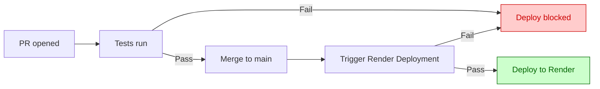

# Local Budget Parser

[](https://github.com/erinep/local_budget/actions/workflows/tests.yml)

A Flask app that turns exported bank transaction CSVs into a visual spending report, with monthly breakdowns, category charts, and drillable transaction lists.

## Usage

Upload a CSV export from your bank. The app categorizes each transaction, filters out transfers and payments, and generates:

- Monthly spending trend chart
- Overall category share (donut chart, drillable to transactions)
- Month-by-month category breakdown
- Merchant to category mapping

### Expected CSV columns

| Column | Description |
|---|---|
| `Transaction Date` | Used for monthly grouping |
| `Description 1` | Merchant name, used for categorization |
| `CAD$` | Transaction amount |

## Category Rules

Matching is substring-based and case-insensitive.

- `generic_categories.json` contains shared keyword rules
- `custom_categories.json` contains personal overrides and is checked first (not committed)

Examples: `NO FRILLS` → Food, `AIRBNB` → Travel, `UBER` → Transport. Anything unmatched falls back to Slush Fund.

## Development

**Install dependencies**
```powershell
.\venv\Scripts\Activate.ps1
pip install -r requirements-dev.txt
```

**Run locally**
```powershell
python app.py
```
Then open `http://127.0.0.1:5000`.

**Run tests**
```powershell
pytest -v
```

**Run with debug mode**
```powershell
$env:FLASK_DEBUG = "true"
python app.py
```

## Deployment

The app is deployed on Render. Merging to `main` triggers an automatic deploy, but only if all tests pass. A failing test suite blocks the deploy and leaves production untouched.



Debug mode is always off in production.

## Project Structure

```
app.py                  Flask app and data processing
templates/              Jinja HTML templates
static/                 CSS and chart rendering (JS)
tests/                  pytest suite
generic_categories.json Shared category keyword rules
render.yaml             Render deployment config
requirements.txt        Production dependencies
requirements-dev.txt    Development and test dependencies
```
