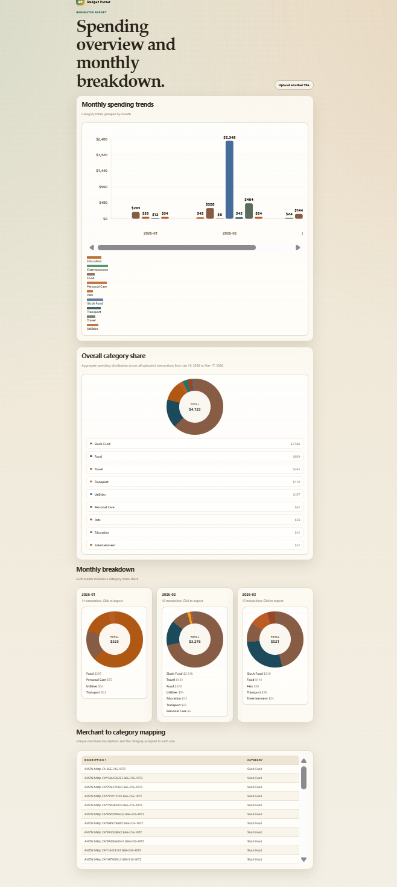

# Local Budget Parser

[](https://github.com/erinep/local_budget/actions/workflows/tests.yml)

A small Flask app for turning exported transaction CSVs into a visual spending report.

## What It Does

- Uploads a CSV of transactions
- Categorizes merchants using generic and personal keyword maps
- Excludes transfer and payment activity that should not be tracked as spend
- Shows:
  - monthly spending trends
  - overall category share
  - month-by-month category breakdowns
  - merchant-to-category mapping
- Lets you drill into:
  - all transactions for a given month
  - all transactions for a given overall category

## Example Output



## Project Structure

- `app.py`: Flask app and data processing
- `templates/`: HTML templates
- `static/`: frontend styling and chart rendering
- `generic_categories.json`: shared category keywords
- `custom_categories.json`: personal overrides

## Category Rules

Matching is substring-based.

- Generic rules are loaded from `generic_categories.json`
- Personal overrides are loaded from `custom_categories.json`
- Custom rules are checked before generic rules
- Matching is case-insensitive

Examples:

- `NO FRILLS` -> `Food`
- `AIRBNB` -> `Travel`
- `LOCAL SALON` -> `Personal Care`

## Running Locally

1. Activate the virtual environment.
2. Install dependencies if needed.
3. Start the Flask app.

Example on Windows PowerShell:

```powershell
.\venv\Scripts\Activate.ps1
pip install flask pandas
python app.py
```

Then open:

```text
http://127.0.0.1:5000
```

## Expected CSV Columns

The uploaded CSV should contain:

- `Transaction Date`
- `Description 1`
- `CAD$`

## Notes

- Transfers, payments, and similar non-spend activity are filtered out in code.
- Charts are rendered on the frontend from raw aggregated data.
- If you update category JSON files while the server is running, restart the app so the new rules are reloaded.
